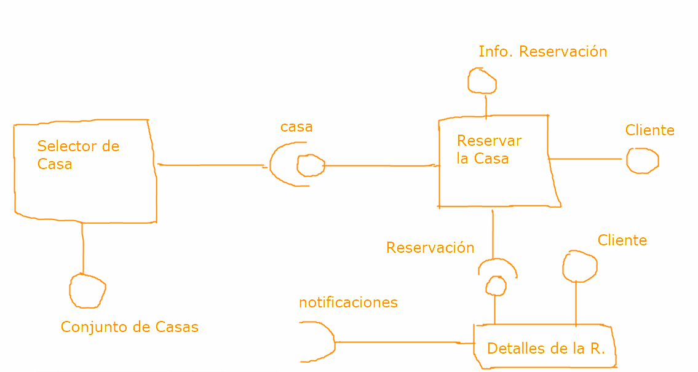

# Sesión 3 - Construir un sistema

    Diplomado de Java - Módulo I
    Departamento de Diplomados y Extensión Profesional
    Centro de Investigación en Cómputo
    Instituto Politécnico Nacional

---

 Por [Alan Badillo Salas](https://github.com/dragonnomada)

---

## 1. Identificar los Componentes de Sistema

    Los componentes resuelven funcionalidades del sistema.
    Es decir, cada componente resuelve una pieza del sistema.

    EJEMPLO:

    Un sistema de reservación de Airbnb:

    * [Selector de Casa] - Selecciona una casa de las disponibles
        - Requiere: Conjunto de Casas
        - Ofrece: La casa seleccionada
    * [Reservar la Casa] - Reservar la casa en las fechas indicadas
        - Requiere: Cliente, InformaciónReservación, Casa
        - Ofrece: Reservación
    * [Detalles de la Reservación] - Muestra los detalles de la reservación
        - Requiere: Cliente, Reservación
        - Ofrece: Noitificaciones
    

## 2. Implementar los Componentes del Sistema

    Para poder implementar los componentes deberemos crear
    clases e interfaces que abstraígan los datos manipulados por componentes.

    EJEMPLO:

    Un sistema de reservación de Airbnb:

    * SelectorCasa - La clase que permite seleccionar una casa
        - List<Casa> casas
        - Casa casaSeleccionada
        - -------------------------------------
        - void setListaCasas(List<Casa> casas)
        - -------------------------------------
        - Casa getCasaSeleccionada()
        - -------------------------------------
        - void seleccionarCasa(int idCasa)
        - void seleccionarCasa(Casa casa)
    * Casa - La clase que permite retener la información de una casa
        - int id
        - int numHabitaciones
        - boolean permiteMascotas
        - ...
    * ReservarCasa - La clase que permita reservar una casa
        - Cliente cliente
        - Casa casa
        - InformacionReservacion infoReservacion
        - Reservacion reservacion
        - ------------------------------------
        - void setCliente(Cliente cliente)
        - void setInfoReservacion(InformacionReservacion infoReservacion)
        - void setCasa(Casa casa)
        - ------------------------------------
        - Reservacion getReservacion()
        - ------------------------------------
        - void generarReservacion()
    * ...

## 3. Conectar la lógica entre los componentes

    Necesecitamos establecer cuáles son los procesos con los objetos
    generados por los componentes y entidades, para poder conectar
    sus lógicas.

    EJEMPLO:

    1. ¿Cómo funciona el selector casas? (¿Cuál es su interfaz?)
    2. ¿Cómo se van a pasar los datos ofertados a los datos requeridos?
    3. ¿Cómo se pueden abstraer las interfaces y los procesos para generalizarlos?

## Ejercicio

Se requiere un sistema de inventarios (reducido) en el que tenemos solamente
la entrada de paquetes al sistema y la salida de estos.

### 1. Componentes

    * [Ver lista de paquetes] - Muestra los paquetes ingresados
        - Requiere: Lista de paquetes (códigos)
    * [Ingresar paquete] - Captura el código de un paquete y lo ingresa
        - Ofrece: Lista de paquetes (códigos)
    * [Verificar existencia paquete] - Captura el código de un paquete 
                                        y verfica si está ingresado
        - Requiere: Lista de paquetes (códigos)
        - Ofrece: Paquete (código)
    * [Retirar paquete] - Captura el código de un paquete y lo retira
        - Requiere: Paquete (código), Lista de paquetes (códigos)

### 2. Implementar

    * [VerListaPaquete]
        - List<Paquete> paquetes
        --------------------------
        + void setPaquetes(List<Paquete> paquetes)
        --------------------------
        + void mostrarLista()
    * [IngresarPaquete]
        - List<Paquete> paquetes
        - Paquete paqueteCapturado
        --------------------------
        + List<Paquete> getListaPaquetes()
        --------------------------
        + Paquete capturarPaquete()
        + void ingresarPaquete(Paquete paquete)
    * [VerificarExistenciaPaquete]
        - List<Paquete> paquetes
        - Paquete paqueteCapturado
        - Paquete paqueteVerificado
        --------------------------
        + void setListaPaquetes(List<Paquete> paquetes)
        --------------------------
        + Paquete getPaqueteVerificado()
        --------------------------
        + Paquete capturarPaquete()
        + void verificarPaquete()
    * [RetirarPaquete]
        - List<Paquete> paquetes
        - Paquete paquetePorRetirar
        - Paquete paqueteRetirado
        --------------------------
        + void setListaPaquetes(List<Paquete> paquetes)
        + void setPaquetePorRetirar(Paquete paquetePorRetirar)
        --------------------------
        + void retirar()
    * [Paquete]
        - String codigo
        - Date fechaIngreso
        - Date fechaRetiro
        --------------------------
        + void describir()
        
    PANTALLAS

    1) Principal

    Sistema de Inventarios
    ---------------------------------
    1. Ver lista de paquetes
    2. Ingresar paquete
    3. Verificar existencia paquete
    4. Retirar paquete
    ---------------------------------
    5. Salir

    2) 1. Ver lista de paquetes
    
    Sistema de Inventarios - Paquetes
    ---------------------------------
    Código | Fecha Ingreso
    -----------------------
    XXXXXX | 2022-03-19 15:44 
    YYYYYY | 2022-03-19 15:47
    ZZZZZZ | 2022-03-19 16:01
    -----------------------
    Total: 3

    3) 2. Ingresar paquete
    
    Sistema de Inventarios - Ingresar
    ---------------------------------
    Código del Paquete: <<xxxxx>>
    INGRESADO: TRUE

    4) 3. Verificar existencia paquete
    
    Sistema de Inventarios - Verificar
    ---------------------------------
    Código del Paquete: <<xxxxx>>
    EXISTE: TRUE

    5) 4. Retirar paquete
    
    Sistema de Inventarios - Retirar
    ---------------------------------
    Código del Paquete: <<xxxxx>>
    RETIRADO: TRUE

