# Manejo de Bases de Datos SQL

## 1. Introducción a las Bases de Datos SQL

Una Base de Datos tipo SQL (Standard Query Language / Lenguaje Estandarizado de Consulta)
se compone de Tablas, las cuales contienen columnas denominados campos y filas denominados registros.

Un campo es una definición nombrada de un tipo de dato que contendrá el registro.

Un registro es un conjunto de valores para cada campo definido.

Entonces podemos pensar que la tabla es una matriz de columnas por cada campo y filas por cada registro.

Un registro forma con sus valores una entidad del sistema, por ejemplo, para almacenar un producto
podemos determinar los campos: `id`, `nombre`, `precio`, `existencias`. Entonces
un registro equivaldría a un producto, por ejemplo, el registro `(1, 'Coca Cola', 17.5, 104)`.

Podemos definir una tabla, mediante su nombre, sus campos y sus registros.

Al conjunto de todas las tablas del sistema, se denomina la base de datos.

> Ejemplo: Un sistema para el control de ventas

```txt
Base de Datos MI_EMPRESA

Tabla CLIENTES
    Campo ID Tipo ENTERO
    Campo NOMBRE Tipo TEXTO CORTO
    Campo DIRECCION Tipo TEXTO LARGO
    
Tabla VENDEDORES
    Campo ID Tipo ENTERO
    Campo NOMBRE Tipo TEXTO CORTO
    Campo ACTIVO Tipo BOOLEANO
    
TABLA VENTAS
    Campo ID Tipo ENTERO
    Campo ID_CLIENTE Tipo ENTERO
    Campo ID_PRODUCTO Tipo ENTERO
    Campo FECHA Tipo FECHA
    Campo PAGADO Tipo BOOLEANO
```

## 2. Instalación MySQL

MySQL es un motor de bases de datos tipo SQL para administrar los datos de forma eficiente y segura.

Podemos descargar MySQL de [mysql.com](https://www.mysql.com)

    1. Ir a https://www.mysql.com

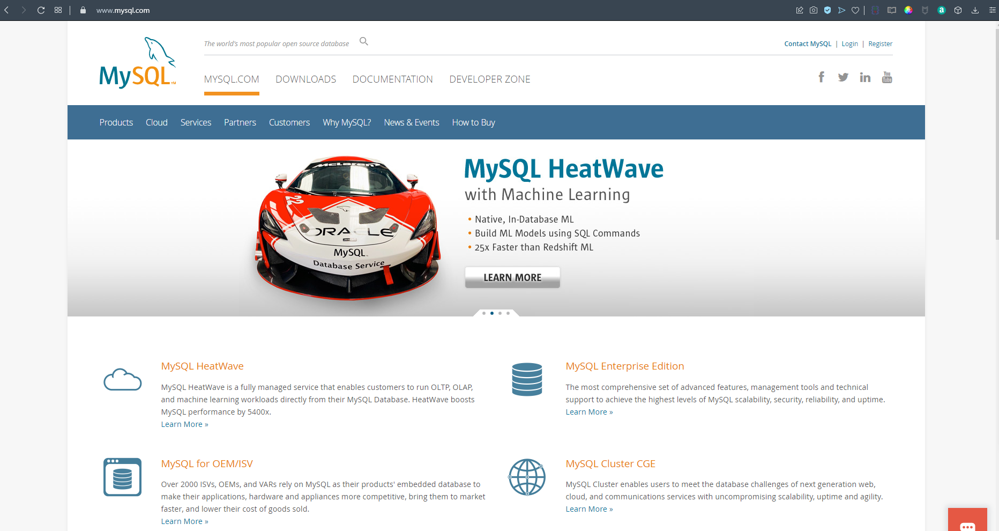

    2. Seleccionar DOWNLOADS

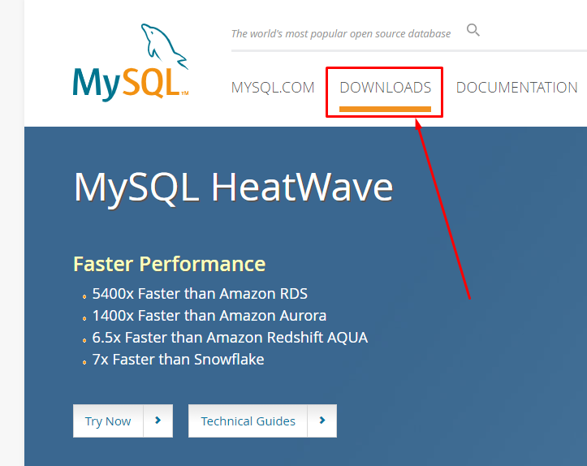

    3. Bajar a MySQL Community (GPL) Downloads »

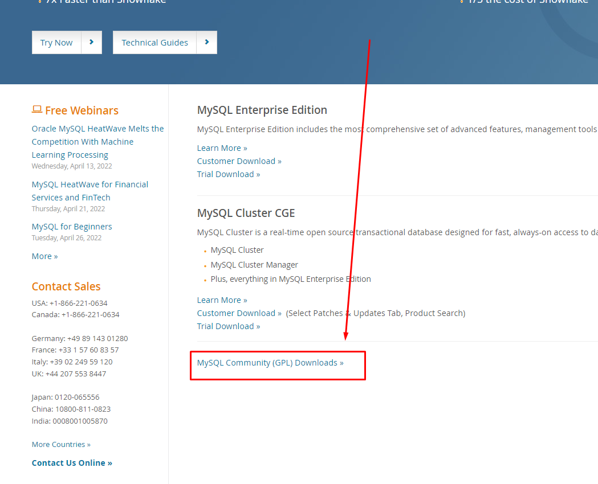

    4. Seleccionar MySQL Community Server

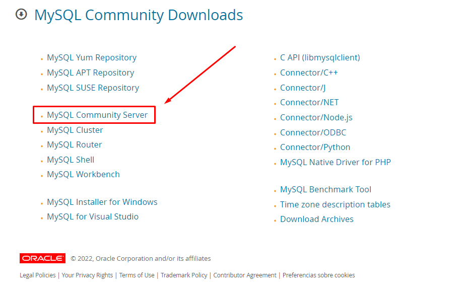

    5. Descargar Windows (x86, 64-bit), ZIP Archive

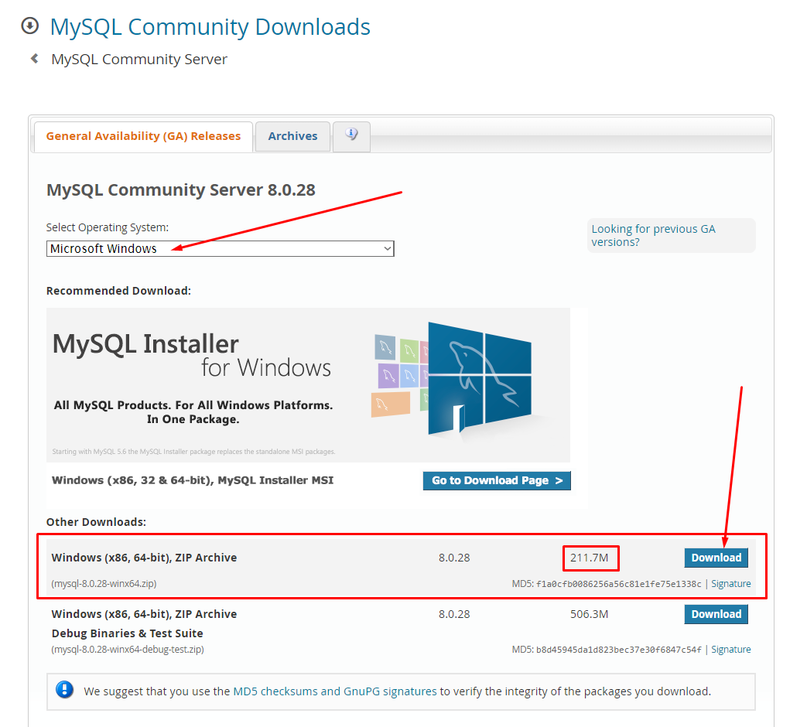

    6. Elegir No thanks, just start my download.

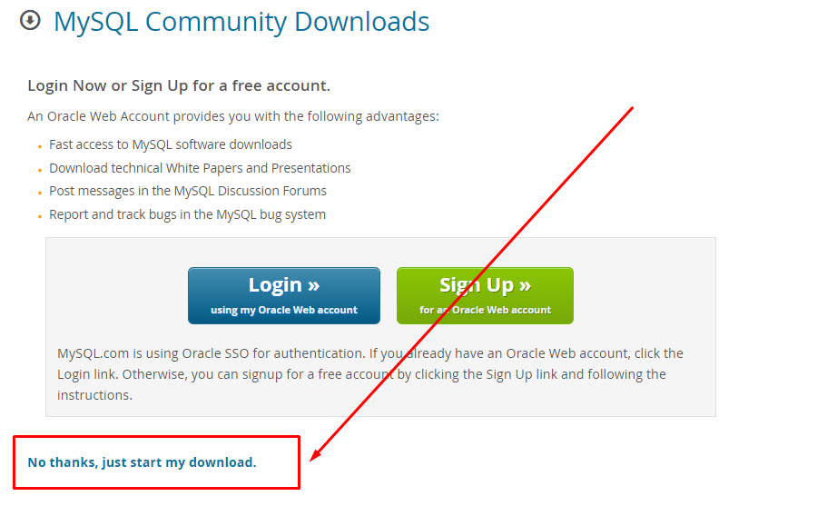

    7. Esperar a que finalice la descarga

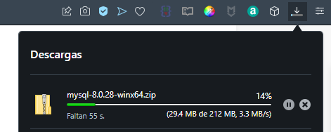

    8. Abrir el ZIP

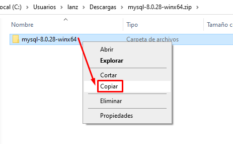

    9. Copiar o extraer el ZIP en C:\

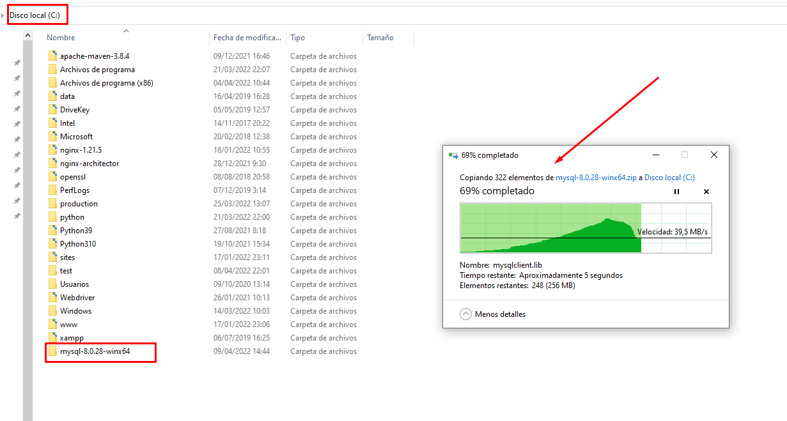

    10. Copiar la ruta a la carpeta `bin` (C:\mysql-8.0.28-winx64\bin)

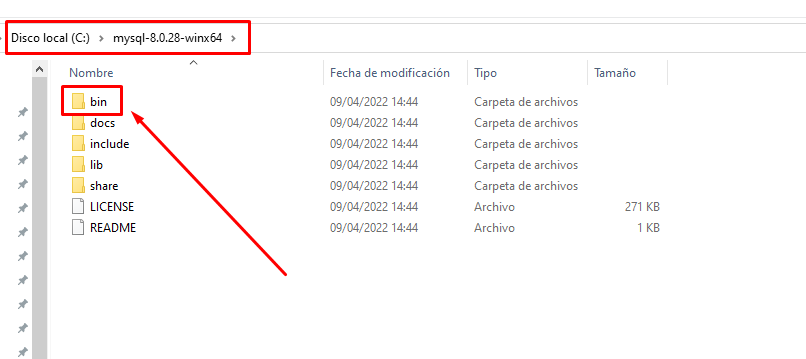

    11. Abrir la configuración del sistema

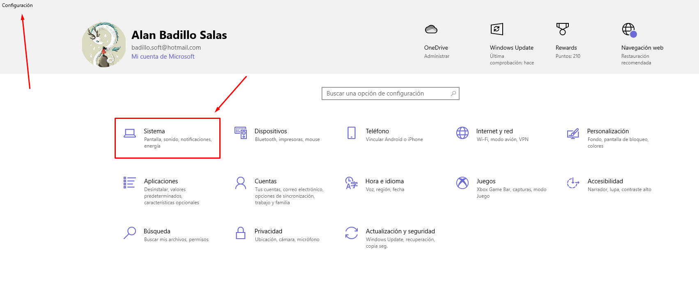

    12. Abrir la configuración avanzada el sistema

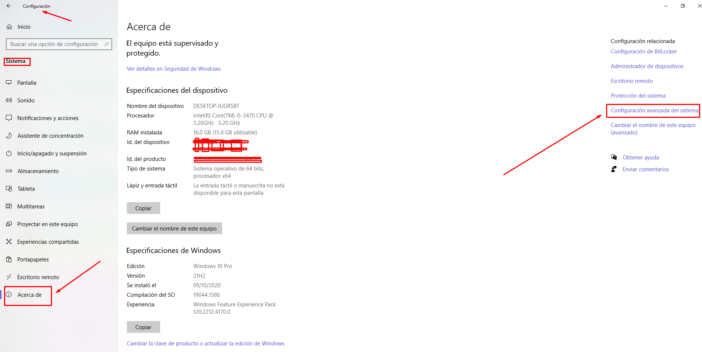

    13. ALTERNATIVAMENTE: Clic secundario en "Este Equipo"

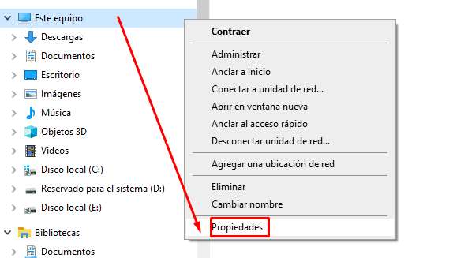

    14. En las Propiedades del Sistema, abrir "Variables de Entorno"

    * [WIN + R] > rundll32.exe sysdm.cpl,EditEnvironmentVariables

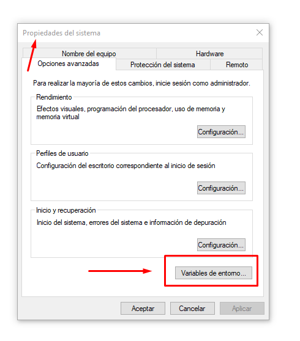

    15. Editar la variable del sistema "Path"

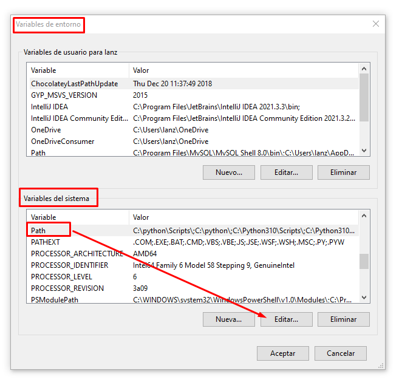

    16. Agregar el nuevo path C:\mysql-8.0.28-winx64\bin

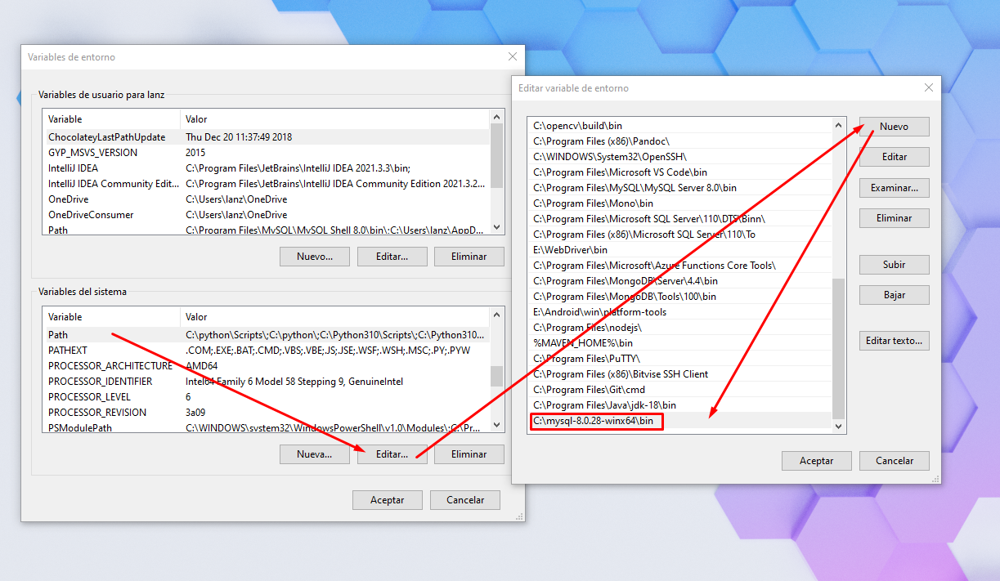

    17. Abrir un símbolo del sistema y escribir `mysql --version`

    [WIN + R] > cmd

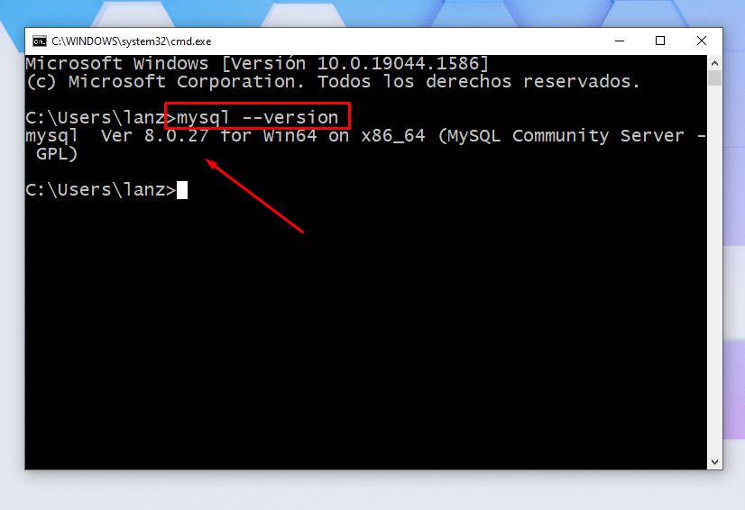

## 3. Administrar Bases de Datos SQL

## 4. Operaciones CRUD (Insertar, Seleccionar, Actualizar y Eliminar)

## 5. Conectar la Bases de Datos a Java

## 6. Realizar Operaciones en la Base de Datos desde Java

## 7. Crear una Interfaz de Usuario para la Base de Datos en Java