# Manejo de Bases de Datos SQL

## 1. Introducción a las Bases de Datos SQL

Una Base de Datos tipo SQL (Standard Query Language / Lenguaje Estandarizado de Consulta)
se compone de Tablas, las cuales contienen columnas denominados campos y filas denominados registros.

Un campo es una definición nombrada de un tipo de dato que contendrá el registro.

Un registro es un conjunto de valores para cada campo definido.

Entonces podemos pensar que la tabla es una matriz de columnas por cada campo y filas por cada registro.

Un registro forma con sus valores una entidad del sistema, por ejemplo, para almacenar un producto
podemos determinar los campos: `id`, `nombre`, `precio`, `existencias`. Entonces
un registro equivaldría a un producto, por ejemplo, el registro `(1, 'Coca Cola', 17.5, 104)`.

Podemos definir una tabla, mediante su nombre, sus campos y sus registros.

Al conjunto de todas las tablas del sistema, se denomina la base de datos.

> Ejemplo: Un sistema para el control de ventas

```txt
Base de Datos MI_EMPRESA

Tabla CLIENTES
    Campo ID Tipo ENTERO
    Campo NOMBRE Tipo TEXTO CORTO
    Campo DIRECCION Tipo TEXTO LARGO
    
Tabla VENDEDORES
    Campo ID Tipo ENTERO
    Campo NOMBRE Tipo TEXTO CORTO
    Campo ACTIVO Tipo BOOLEANO
    
TABLA VENTAS
    Campo ID Tipo ENTERO
    Campo ID_CLIENTE Tipo ENTERO
    Campo ID_PRODUCTO Tipo ENTERO
    Campo FECHA Tipo FECHA
    Campo PAGADO Tipo BOOLEANO
```

## 2. Instalación MySQL

MySQL es un motor de bases de datos tipo SQL para administrar los datos de forma eficiente y segura.

Podemos descargar MySQL de [mysql.com](https://www.mysql.com)

    1. Ir a https://www.mysql.com


    2. Seleccionar DOWNLOADS


    3. Bajar a MySQL Community (GPL) Downloads »


    4. Seleccionar MySQL Community Server


    5. Descargar Windows (x86, 64-bit), ZIP Archive


    6. Elegir No thanks, just start my download.


    7. Esperar a que finalice la descarga


    8. Abrir el ZIP


    9. Copiar o extraer el ZIP en C:\


    10. Copiar la ruta a la carpeta `bin` (C:\mysql-8.0.28-winx64\bin)


    11. Abrir la configuración del sistema


    12. Abrir la configuración avanzada el sistema


    13. ALTERNATIVAMENTE: Clic secundario en "Este Equipo"


    14. En las Propiedades del Sistema, abrir "Variables de Entorno"

    * [WIN + R] > rundll32.exe sysdm.cpl,EditEnvironmentVariables


    15. Editar la variable del sistema "Path"


    16. Agregar el nuevo path C:\mysql-8.0.28-winx64\bin

    * Nota la carpeta debe ser la misma que la del paso 10


    17. Abrir un símbolo del sistema y escribir: mysql --version

    [WIN + R] > cmd


    18. Crear el archivo C:\mysql-8.0.28-winx64\mysql-init.txt

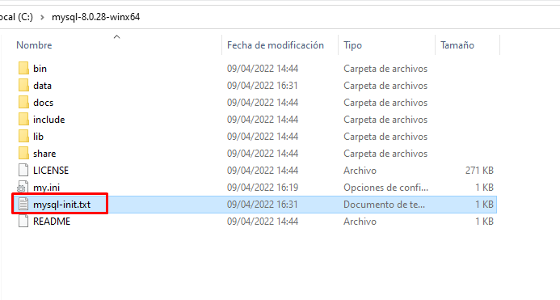

    19. Colocar el comando para cambiar la contraseña del root

    ALTER USER 'root'@'localhost' IDENTIFIED BY 'password';

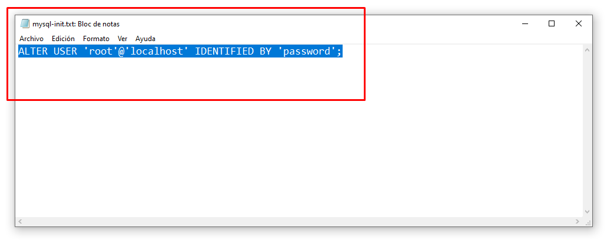

    20. Inicializar mysqld

    > mysqld --initialize --user=mysql --console

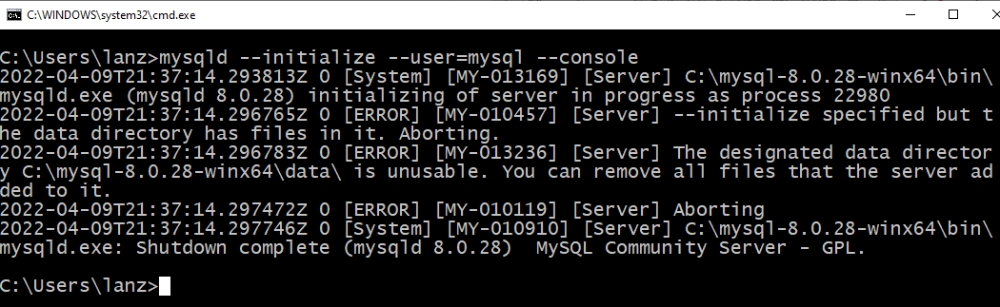

    21. Inicializar MySQL

    > mysqld --console --init-file=C:\mysql-8.0.28-winx64\mysql-init.txt

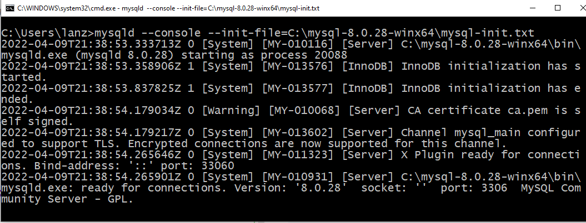

    22. En otra terminal conectarse con root

    > mysql -u root -p

    Password: *****

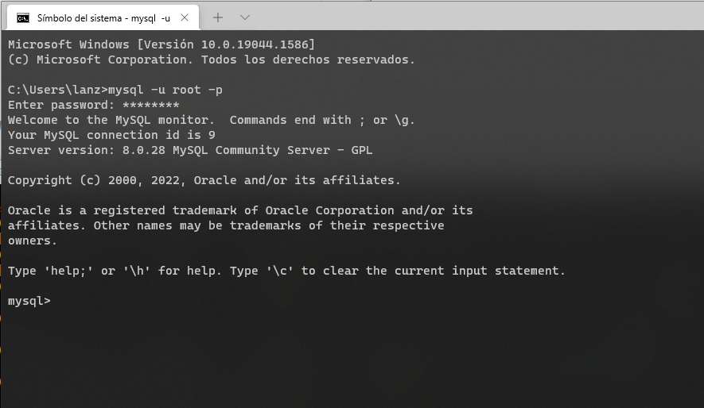

## 3. Administrar Bases de Datos SQL

> Crear una base de datos

    mysql> create database <nombre>;

> Mostrar todas las bases de datos

    mysql> show databases;

> Eliminar una base de datos

    CUIDADO: Es irreversible

    mysql> drop database <nombre>;

> Usar una base de datos

    mysql> use <nombre>;

> Crear una tabla

    mysql> create table <tabla> ( <campo 1>, <campo 2>, ..., <campo n> );

    EJEMPLO:

    create table prueba (
        id int primary key auto_increment,
        nombre varchar(255)
    );

**Campos de Ejemplo**

| Campo                               | Descripción                                                              |
|-------------------------------------|--------------------------------------------------------------------------|
| `id int primary key auto_increment` | Crea el campo `id` entero que con llave principal y autoincrementable    |
| `nombre varchar(255)`               | Crea el campo `nombre` con un texto de hasta `255` caracteres            |
| `edad int`                          | Crea el campo entero `edad`                                              |
| `peso double`                       | Crea el campo decimal `peso`                                             |
| `correo varchar(120) not null`      | Crea el campo de texto de hasta `120` caracteres obligatorio (no nulo)   |

> Mostrar las tablas de nuestra base de datos

    mysql> show tables;

> Describir una tabla

    mysql> describe <tabla>;

> Eliminar toda la tabla

    CUIDADO: Es irreversible

    drop table <tabla>

## 4. Operaciones CRUD (Insertar, Seleccionar, Actualizar y Eliminar)

> Insertar un registro en una tabla

    mysql> insert into <tabla> (<campo 1>, ..., <campo n>) values (<valor 1>, ..., <valor n>);

    EJEMPLO:

    insert into prueba (nombre) values ('Prueba 1');
    insert into prueba (nombre) values ('Prueba 2');

> Seleccionar registro de una tabla

    # Seleccionar registros en todos los campos

    select * from <tabla>;

    # Seleccionar registros en campos específicos

    select <campo 1>, ..., <campo n> from <tabla>;

    # Seleccionar registros con alguna condición

    select [<campos>] from <tabla> where [<condiciones>];

**Condiciones de Ejemplo**

| Condición                             | Descripción                                                  |
|---------------------------------------|--------------------------------------------------------------|
| `where id = 1`                        | Dónde el `id` sea `1`                                        |
| `where nombre like 'prueba%'`         | Dónde el `nombre` contenga la palabra `prueba` y demás texto |
| `where precio > 10 and precio <= 20 ` | Precio mayor a `10` y menor o igual a `20`                   |
| `where precio < 100 or precio > 1000` | Precio menor a `100` o mayor a `1,000`                       |

> Actualizar un registro de una tabla

    ADVERTENCIA: Usa WHERE para determinar cuándo actualizar

    mysql> update <tabla> set <campo 1>=<valor 1>, ..., <campo n>=<valor n> where [<condiciones>];

    EJEMPLO:

    update prueba set nombre='Prueba 1 (modificado)' where id=1;

> Eliminar un registro de una tabla

    CUIDADO: Usa WHERE para determinar cuándo actualizar

    mysql> delete from <tabla> where [<condiciones>];

    EJEMPLO:

    delete from prueba where id=1;

## 5. Conectar la Bases de Datos a Java

    1. Abrir la estructura del proyecto

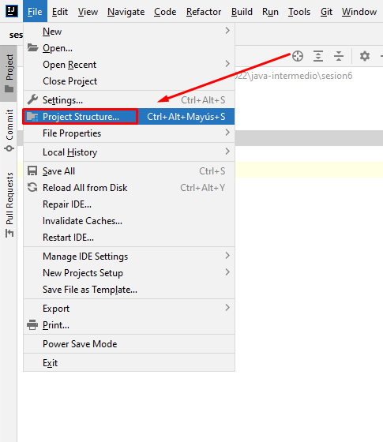

    2. Agregar una librería de Maven

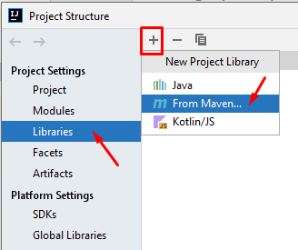

    3. Buscar la librería de mysql-connector

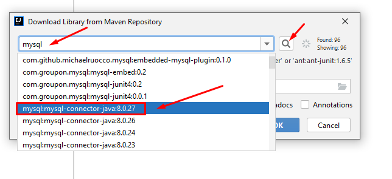

    4. Seleccionamos la librería mysql-connector:8.0.27

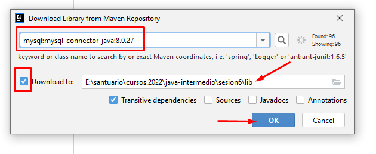

    5. La librería ya está registrada 

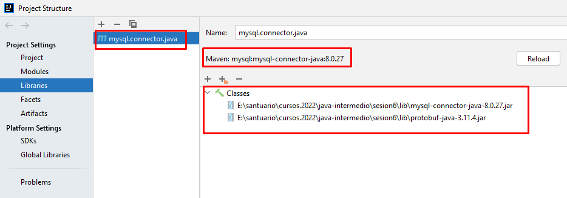

    6. Ya se ubica mysql-connector-java-8.0.27.jar

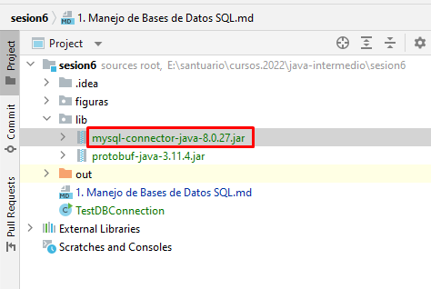

    7. Crear una prueba para el driver

    String driver = "com.mysql.cj.jdbc.Driver";

    Class.forName(driver).getDeclaredConstructor().newInstance();

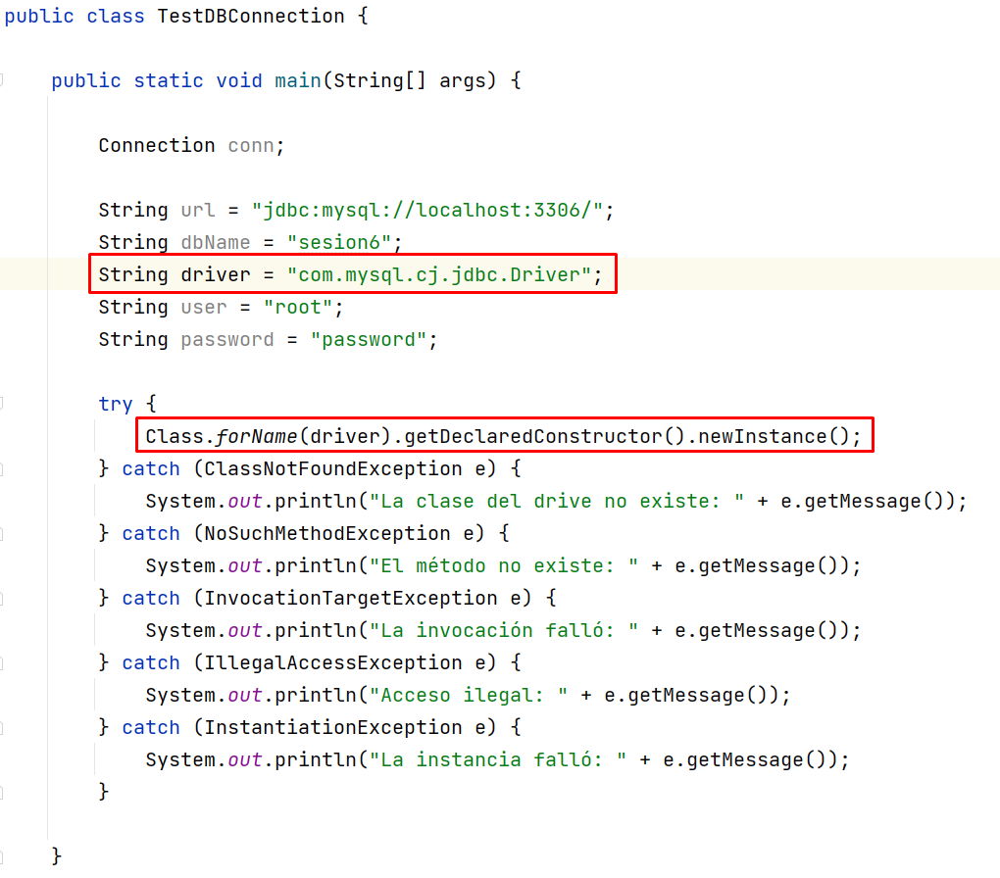    

    8. Ejecutar la prueba y verficar que no haya error

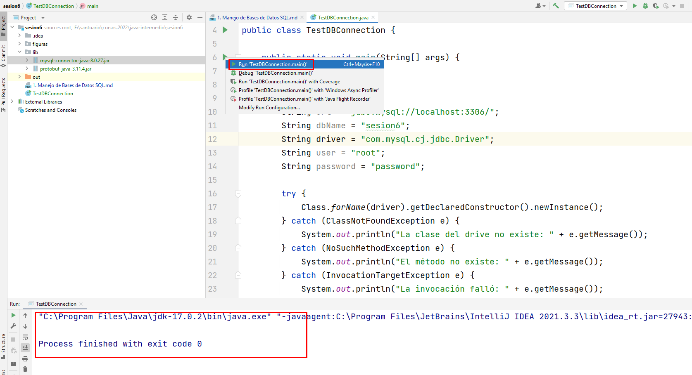

> Conectarse a la base de datos

```java
import java.lang.reflect.InvocationTargetException;
import java.sql.Connection;
import java.sql.DriverManager;
import java.sql.SQLException;

public class TestDBConnection {

    public static void main(String[] args) {

        Connection conn;

        String url = "jdbc:mysql://localhost:3306/";
        String dbName = "sesion6";
        String driver = "com.mysql.cj.jdbc.Driver";
        String user = "root";
        String password = "password";

        try {
            Class.forName(driver).getDeclaredConstructor().newInstance();

            conn = DriverManager.getConnection(url + dbName, user, password);

            System.out.println("Conectado correctamente a la base de datos");

            // TODO: Realizar operaciones en la base de datos
            
            conn.close();

            System.out.println("Conexión cerrada exitosamente");
        } catch (ClassNotFoundException e) {
            System.out.println("La clase del drive no existe: " + e.getMessage());
        } catch (NoSuchMethodException e) {
            System.out.println("El método no existe: " + e.getMessage());
        } catch (InvocationTargetException e) {
            System.out.println("La invocación falló: " + e.getMessage());
        } catch (IllegalAccessException e) {
            System.out.println("Acceso ilegal: " + e.getMessage());
        } catch (InstantiationException e) {
            System.out.println("La instancia falló: " + e.getMessage());
        } catch (SQLException e) {
            System.out.println("Falló SQL: " + e.getMessage());
        }

    }

}
```

## 6. Realizar Operaciones en la Base de Datos desde Java

> Inserción

```java
import java.lang.reflect.InvocationTargetException;
import java.sql.*;

public class TestInsert {

    public static void main(String[] args) throws ClassNotFoundException, NoSuchMethodException, InvocationTargetException, InstantiationException, IllegalAccessException, SQLException {

        Connection conn;

        String url = "jdbc:mysql://localhost:3306/";
        String dbName = "sesion6";
        String driver = "com.mysql.cj.jdbc.Driver";
        String user = "root";
        String password = "password";

        Class.forName(driver).getDeclaredConstructor().newInstance();

        conn = DriverManager.getConnection(url + dbName, user, password);

        System.out.println("Conectado correctamente a la base de datos");

        PreparedStatement statement = conn.prepareStatement("INSERT INTO prueba (nombre) values (?)");

        statement.setString(1, "Prueba 4");

        int count = statement.executeUpdate();

        System.out.printf("Se insertaron %d registros\n", count);

        statement.close();

        conn.close();

        System.out.println("Conexión cerrada exitosamente");

    }

}
```

> Selección

```java
import java.lang.reflect.InvocationTargetException;
import java.sql.*;

public class TestSelect {

    public static void main(String[] args) throws ClassNotFoundException, NoSuchMethodException, InvocationTargetException, InstantiationException, IllegalAccessException, SQLException {

        Connection conn;

        String url = "jdbc:mysql://localhost:3306/";
        String dbName = "sesion6";
        String driver = "com.mysql.cj.jdbc.Driver";
        String user = "root";
        String password = "password";

        Class.forName(driver).getDeclaredConstructor().newInstance();

        conn = DriverManager.getConnection(url + dbName, user, password);

        System.out.println("Conectado correctamente a la base de datos");

        PreparedStatement statement = conn.prepareStatement("SELECT * FROM prueba");

        ResultSet resultSet = statement.executeQuery();

        while (resultSet.next()) {
            System.out.println("ID: " + resultSet.getInt("id"));
            System.out.println("NOMBRE: " + resultSet.getString("nombre"));
            System.out.println("------------------------");
        }

        resultSet.close();
        statement.close();

        conn.close();

        System.out.println("Conexión cerrada exitosamente");

    }

}
```

## 7. Crear una Interfaz de Usuario para la Base de Datos en Java

> Interfaz

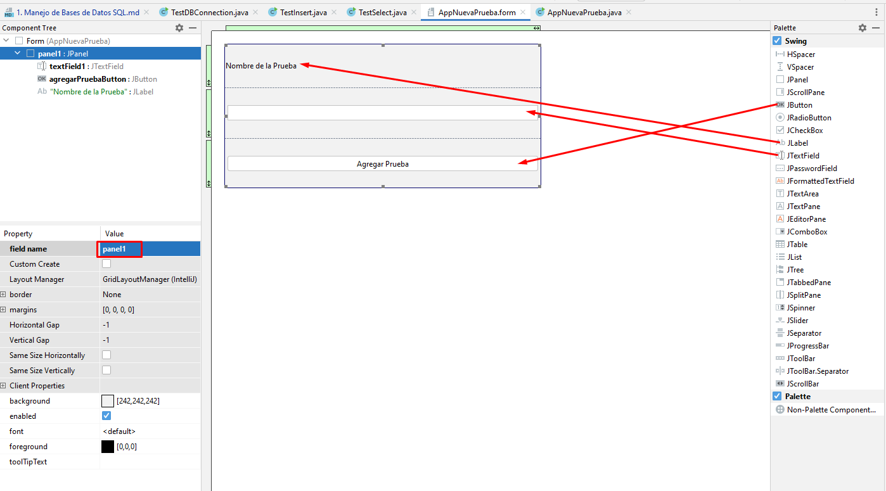

> Código de la Interfaz

```java
import javax.swing.*;
import java.awt.event.ActionEvent;
import java.awt.event.ActionListener;
import java.lang.reflect.InvocationTargetException;
import java.sql.Connection;
import java.sql.DriverManager;
import java.sql.PreparedStatement;
import java.sql.SQLException;

public class AppNuevaPrueba {
    private JTextField textField1;
    private JButton agregarPruebaButton;
    private JPanel panel1;

    public AppNuevaPrueba() throws ClassNotFoundException, NoSuchMethodException, InvocationTargetException, InstantiationException, IllegalAccessException, SQLException {
        Connection conn;

        String url = "jdbc:mysql://localhost:3306/";
        String dbName = "sesion6";
        String driver = "com.mysql.cj.jdbc.Driver";
        String user = "root";
        String password = "password";

        Class.forName(driver).getDeclaredConstructor().newInstance();

        conn = DriverManager.getConnection(url + dbName, user, password);

        agregarPruebaButton.addActionListener(new ActionListener() {
            @Override
            public void actionPerformed(ActionEvent e) {
                System.out.println("Conectado correctamente a la base de datos");

                PreparedStatement statement = null;
                try {
                    statement = conn.prepareStatement("INSERT INTO prueba (nombre) values (?)");
                } catch (SQLException ex) {
                    ex.printStackTrace();
                }

                try {
                    statement.setString(1, textField1.getText());
                } catch (SQLException ex) {
                    ex.printStackTrace();
                }

                int count = 0;
                try {
                    count = statement.executeUpdate();
                } catch (SQLException ex) {
                    ex.printStackTrace();
                }

                System.out.printf("Se insertaron %d registros\n", count);

                try {
                    statement.close();
                } catch (SQLException ex) {
                    ex.printStackTrace();
                }
            }
        });
    }

    public static void main(String[] args) throws SQLException, ClassNotFoundException, InvocationTargetException, NoSuchMethodException, InstantiationException, IllegalAccessException {
        JFrame frame = new JFrame();

        AppNuevaPrueba app = new AppNuevaPrueba();

        frame.add(app.panel1);

        frame.setSize(400, 400);

        frame.setDefaultCloseOperation(JFrame.EXIT_ON_CLOSE);

        frame.setVisible(true);
    }

}
```